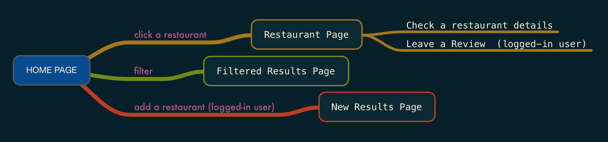

# Restaurant Review App 

## Overview

With this restaurant review app, you can easily search for nearby restaurants, read plenty of reviews, and even view great local deals and opening hours of the place. Search filters ensure that you can narrow things down according to distance, price, and rating, so you know exactly what you’re getting into. 


## Data Model

The application will store Users, Restaurants and Reviews.

* ***users*** can have username, password hash, and restaurants saved.
* each ***restaurant*** will have basic info (name, location, photo, type of cuisine, price, opening hours, etc), and reviews from users.
* each user ***review*** will have "name", "date","rating", and "comments".


An Example User:

```javascript
{
  username: "john",
  hash: // a password hash,
  saved_restaurants: // an array of references to Restaurant documents
}
```

An Example Restaurant with Embedded Reviews:

```JSON
{
  "restaurant": {
    "id": 1,
    "name": "Mission Chinese Food",
    "neighborhood": "Manhattan",
    "photograph": "1.jpg",
    "address": "171 E Broadway, New York, NY 10002",
    },
    "cuisine_type": "Asian",
    "price": "$$$",
    "reviews": [{
        "name": "Steve",
        "date": "October 27, 2016",
        "rating": 4,
        "comments": "Mission Chinese Food has grown up from its scrappy Orchard Street days into a big, two story restaurant equipped with a pizza oven, a prime rib cart, and a much broader menu. Yes, it still has all the hits — the kung pao pastrami, the thrice cooked bacon —but chef/proprietor Danny Bowien and executive chef Angela Dimayuga have also added a raw bar, two generous family-style set menus, and showstoppers like duck baked in clay. And you can still get a lot of food without breaking the bank."
      },
      {
        "name": "Morgan",
        "date": "October 28, 2016",
        "rating": 4,
        "comments": "This place is a blast. Must orders: GREEN TEA NOODS, sounds gross (to me at least) but these were incredible!, Kung pao pastrami (but you already knew that), beef tartare was a fun appetizer that we decided to try, the spicy ma po tofu SUPER spicy but delicous, egg rolls and scallion pancake i could have passed on... I wish we would have gone with a larger group, so much more I would have liked to try!"
      },
      {
        "name": "Jason",
        "date": "November 26, 2016",
        "rating": 3,
        "comments": "I was VERY excited to come here after seeing and hearing so many good things about this place. Having read much, I knew going into it that it was not going to be authentic Chinese. The place was edgy, had a punk rock throwback attitude, and generally delivered the desired atmosphere. Things went downhill from there though. The food was okay at best and the best qualities were easily overshadowed by what I believe to be poor decisions by the kitchen staff."
      }
    ]
  }
}
```


## [Link to Commented Schema](db.js) 


## Site map



## User Stories 


1. as non-registered user, I can register a new account with the site
2. as non-registered user, I can browse the restaurants on the map
3. as a user, I can log in to the site
4. as a user, I can search the restaurants based on my preference
5. as a user, I can add reviews to restaurants
6. as a user, I can view all of the restaurants I saved to my list
7. as a user, I can remove restaurants from my "saved" list

## Research Topics

* (5 points) Integrate user authentication
    * I'm going to be using passport for user authentication
    * see <code>cs.nyu.edu/~jversoza/ait-final/register</code> for register page
    * see <code>cs.nyu.edu/~jversoza/ait-final/login</code> for login page
* (3 points) Unit testing with JavaScript
    * Jasmine
    * Minimally 4 tests


## [Link to Main Project File](app.js) 


## Annotations / References Used


1. [passport.js authentication docs](http://passportjs.org/docs) - (add link to source code that was based on this)
2. [tutorial on jasmine unit testing](https://jasmine.github.io/) - (add link to source code that was based on this)

